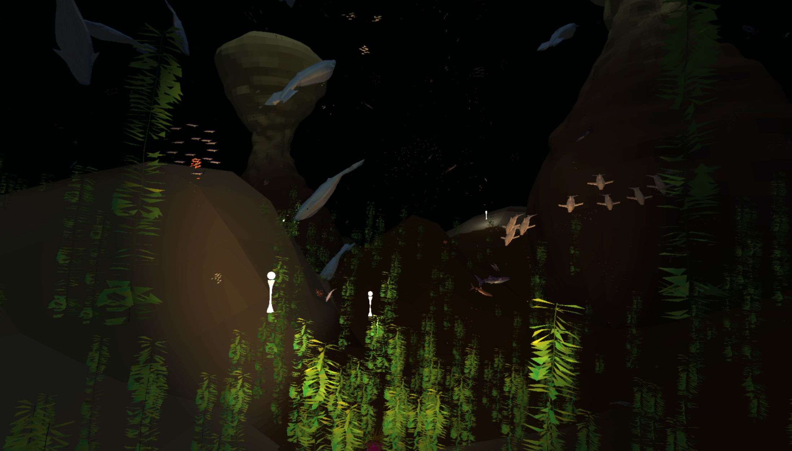

# CS7GV6 Project 1

## Open Ocean Environment

"Open Ocean with Schooling Fish – Focus on animating the behavior of large schools of fish, with predators interacting."

An underwater environment simulation using boids in OpenGL. Contains different animated fish models that interact with each other and anemone around the sea floor. Created for the CS7GV6 Computer Graphics module at Trinity College Dublin.

Full video demonstration: <https://youtu.be/WUkUC-dtAdE>

### Content

Contains:

- Predator and prey behaviour
- Instancing via `glMultiDrawElementsIndrect`
- GPU parellisation via compute shaders (and an unused implementation of a CPU octree)
- GPU-processed animations for all fish
- Custom environment and fish models and textures and ability to toggle the visibility of both
- Toggleable debug menu via ImGui using the TAB button

Potential future milestones:

- Frustum/instance culling
- Collision avoidance
- Procedural generation
- Regular grid on the GPU

## Credits

Sea anemone model: Modified and re-textured from original model: <https://sketchfab.com/3d-models/sea-anemone-from-poly-by-google-d0a95c4a26ee4d358135c19c0b94dad7>

Palm tree and accessories: Re-textured from original model: <https://www.cgtrader.com/free-3d-models/exterior/landscape/beach-scene>
